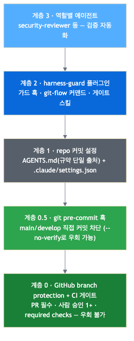
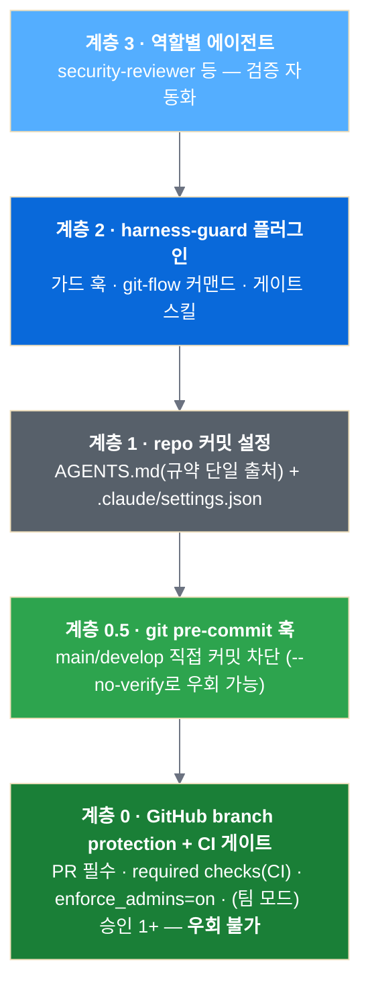
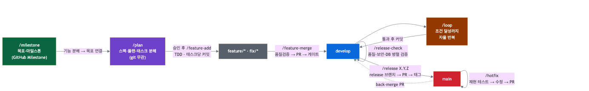
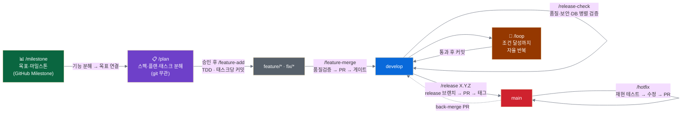

# 🛡️ team-harness — AI 코딩 거버넌스 하네스

> **"팀을 위한 AI 코딩 거버넌스 — 합의는 문서 한 곳에, 강제는 서버에."**


5–10명이 각자의 방식으로 AI 코딩 도구를 쓰면, 코드 편차는 AI 도입 전보다 오히려 커진다.
이 repo는 그 문제를 세 가지 축으로 푼다:

1. **Claude Code 플러그인 마켓플레이스** — 가드·커맨드·절차를 버전 있는 플러그인으로 배포
2. **repo 커밋 설정** — 규약의 단일 출처(`AGENTS.md`)를 도구 무관하게 공유
3. **git / CI 강제** — branch protection과 CI 게이트로 "지킬 수밖에 없는" 구조를 서버에 설치

핵심 통찰은 단순하다. **AI에게 "부탁"하는 규칙은 강제가 아니다.** 프롬프트와 훅은 우회될 수 있고,
도구마다 동작이 다르다. 그래서 강제력의 원천을 GitHub(서버)까지 내려보내고, 위 계층은
그 위에서 *편의와 자동화*를 제공하도록 역할을 나눈다.

## 목차

- [✨ 주요 기능](#-주요-기능)
- [🧱 기술 스택](#-기술-스택)
- [🏗️ 아키텍처](#️-아키텍처)
- [harness-guard 플러그인](#harness-guard-플러그인)
- [🚀 빠른 시작](#-빠른-시작)
- [🧪 테스트](#-테스트)
- [📁 repo 구조](#-repo-구조)
- [📚 팀 표준 문서](#-팀-표준-문서-docs)
- [📄 라이선스](#-라이선스)

---

## ✨ 주요 기능

| 기능 | 설명 |
|---|---|
| 🛡️ 가드 훅 | main/develop 직접 커밋·force push·맨손 `gh pr` 차단 — 차단 시 audit 로그 기록 |
| 📋 의도 라우터 | 캐주얼 지시("진행해/해줘") → 현재 git 상태에서 다음 하네스 스킬 자동 안내 |
| 🔄 git-flow 커맨드 | `/plan`·`/feature-add`·`/feature-merge`·`/release-check`·`/release`·`/hotfix` 전 구간 |
| 🔍 PR 게이트 스킬 | `pr-review-gate` — AI 리뷰·사람 승인·CI·commit-status 단일 절차 |
| 🔒 솔로 머지 | `/solo-merge` — 자기 PR 승인 불가 제약을 review 보호 일시 해제·복구로 처리 |
| 📦 드리프트 점검 | `/repo-sync` — 프로젝트 ↔ team-harness 표준 드리프트 감지 및 백필 PR 제안 |
| 🏅 릴리즈 검증 | `/release-check` — 품질(A)·보안(B)·DB 마이그레이션(C) 병렬 검증 에이전트 |

## 🧱 기술 스택

| 영역 | 스택 |
|---|---|
| 플러그인 배포 | Claude Code 마켓플레이스 (로컬 private 마켓) |
| 가드·훅 | Bash (PreToolUse, UserPromptSubmit 훅) |
| 의도 라우터 | Node.js (ES modules, `route-intent.mjs`) |
| CI 게이트 | GitHub Actions (`templates/ci/`) |
| 에이전트 | Claude Opus (`security-reviewer`·`verifier`) |
| 테스트 | Bash 통합 테스트 (`tests/route-intent-test.sh`) |

## 🏗️ 아키텍처

아래로 내려갈수록 강제력이 세지고, AI 도구 중립적이 된다.



<details>
<summary>mermaid 소스 (GitHub 웹에선 차트로 렌더)</summary>



</details>

| 계층 | 강제 대상 | 위치 |
|---|---|---|
| 0 — branch protection + CI 게이트 | **모든 사람 · 모든 AI 도구** | GitHub (`templates/ci/`) |
| 0.5 — git pre-commit 훅 | 모든 사람 · 모든 AI 도구 | 각 repo `.githooks/` (`templates/githooks/`) |
| 1 — AGENTS.md + `.claude/` 커밋 설정 | repo를 clone한 전원 | 각 프로젝트 repo (`templates/`) |
| 2 — harness-guard 플러그인 | Claude Code 사용자 | 이 repo (`plugins/`) |
| 3 — 역할별 named agents | Claude Code 사용자 | 플러그인 + 프로젝트 `.claude/agents/` |

> Claude Code가 아닌 도구를 쓰는 팀(기획·마케팅 등)도 `AGENTS.md` 하나만 보면 된다 —
> Codex는 네이티브로 읽고, Gemini CLI는 contextFileName 설정으로 읽는다.
> 계층 2–3은 못 쓰더라도 **계층 0은 도구와 무관하게 전원에게 강제된다.**

---

## harness-guard 플러그인

공식 플러그인이 제공하지 않는 **자체 정책만** 담는다.

| 구성 요소 | 내용 |
|---|---|
| **가드 훅** (PreToolUse) | `guard.sh` — main/develop 직접 커밋·force push, `git reset --hard`, **검증기·마이그레이션 삭제**, 핵심 디렉터리 `rm -rf`, npm 글로벌 설치, **맨손 `gh pr create`·`gh pr merge`**(PR 생성·머지는 래퍼 스크립트=스킬 경유만 — 반사적 우회 차단) 차단 (`cd` 체인·서브셸·`git -C` 우회 포함, 보조 장치 — 최종 강제는 계층 0). **차단 시 `~/.claude/hooks/guard-block.log`에 session_id·cwd·명령(크레덴셜·토큰 마스킹) 기록**(멀티세션 위반 시도 감사). + LLM 프롬프트 훅 — 시크릿 외부 유출 패턴 전용 탐지 |
| **PR 래퍼 스크립트** | `pr-create.sh`(base 자동감지·push·생성) · `pr-merge.sh`(CI·스레드·mergeable 게이트 후 머지) — guard가 맨손 gh를 막으므로 **PR 생성·머지의 유일 경로**. 스킬이 이 스크립트를 호출(내부 gh는 자식 프로세스라 훅에 안 걸림) |
| **의도 라우터** (UserPromptSubmit) | `route-intent.mjs` — 매 프롬프트마다 git/PR 상태에서 현재 하네스 단계를 판정해, "진행해/해줘" 류 캐주얼 지시일 때 **다음 단계 스킬 호출을 컨텍스트에 주입**(열린 PR→`/pr-review-gate`·솔로면 `/solo-merge`, feature 브랜치+커밋→`/feature-merge` 등). 반사적 맨손 gh/git 대신 스킬을 쓰게 유도. read-only·fail-open(상태 불명확/비-actionable엔 무주입) |
| **마일스톤 커맨드** | `/milestone` — 제품·마일스톤 정의→기능 분해→GitHub 마일스톤 생성→진행률 대시보드. `/plan` 위에 놓이는 목표 레이어. Claude Code 내장 `/goal`(세션 stopping condition)과 보완 관계 |
| **계획 커맨드** | `/plan` — 스펙·플랜·태스크 분해(git 무관, `docs/specs/` 산출). 코드 전에 의도·수용기준 박제 |
| **개발 커맨드** | `/feature-add` · `/feature-modify` — TDD(RED→GREEN→Refactor), 태스크당 원자적 커밋. 빌드·테스트 명령은 AGENTS.md에서 읽는다 |
| **자율 루프 커맨드** | `/loop` — 동기 조건-루프. CI·lint·테스트 등 "통과할 때까지 즉시 반복" 작업을 안전 장치(max·stuck·checkpoint) 안에서 자동화. 내장 `/loop`(ScheduleWakeup 비동기 예약)와 별개 |
| **품질 커맨드** | `/qa` — 프론트엔드 QA: 디자인 토큰 준수 + WCAG 2.2 접근성 검증 (`/feature-add`의 TDD 로직과 직교한 비주얼·a11y 축) |
| **릴리즈 검증** | `/release-check` — 릴리즈 전 품질(Agent A)·보안(Agent B)·DB 마이그레이션(Agent C) 병렬 검증 |
| **드리프트 점검** | `/repo-sync` — 프로젝트 ↔ team-harness 표준 드리프트 점검(`check-repo-sync`). 스택 감지 후 필수 자산(test-guard·commitlint·secret-scan·migration-safety·rules) 누락 리포트 |
| **PR 생성** | `/pr-create` — base 자동감지(develop 있으면 develop, 없으면 기본 브랜치) PR 생성 **단일 프리미티브**. 맨손 `gh pr create` 대체 — develop 없는 main 기반 repo도 한 경로로. `feature-merge`가 PR 생성 단계를 이 스킬에 위임 |
| **머지·릴리즈 커맨드** | `/feature-merge` · `/hotfix` · `/release` · `/solo-merge` — git-flow 전 구간을 게이트 경유로 자동화 |
| **스킬** `pr-review-gate` | PR 생성→머지의 표준 게이트 절차 **단일 출처** — AI 리뷰 스레드 reply+resolve, 사람 승인 확인, CI watch, 외부 배포 commit-status 검증 |
| **에이전트** `security-reviewer` | 릴리즈 전 보안 검토(XSS·SQL 인젝션·하드코딩 시크릿·.env 추적) — 읽기 전용, opus |
| **에이전트** `verifier` | 검증·연구·설계 판단 전용 — 계획·코드의 정확성을 다른 각도로 재검토, 누락·회귀·논리오류 보고(읽기 전용, opus) |

### git-flow와 커맨드의 관계



<details>
<summary>mermaid 소스 (GitHub 웹에선 차트로 렌더)</summary>



</details>

흐름: `/milestone`(목표·마일스톤 정의) → `/plan`(기능 단위 계획·승인, plan mode 강제) → **`feature/*` 한 브랜치**에서 태스크별 `/feature-add`(TDD) →
`/feature-merge`(한 PR). *한 기능 = 한 브랜치 = 한 PR.*
`/loop`: develop에서 CI·lint·테스트 등 반복 수정을 exit 0까지 동기 자율 실행.
내장 `/goal`(세션 stopping condition)·`/loop`(ScheduleWakeup 비동기)는 별도 유지.

모든 경로는 PR을 경유하고, 머지 전에 `pr-review-gate`의 게이트
(AI 리뷰 처리 → CI → 외부 배포 상태, **팀 모드는 + 사람 승인**)를 통과해야 한다.
**솔로 표준**(승인요건 0)에선 CI·스레드 resolve가 우회불가 게이트이고 사람 승인 단계는 생략된다 — enforce_admins=on이 소유자·AI에게도 CI-green을 강제한다(pr-review-gate §4).
팀은 `set-branch-protection.sh --approvals N`으로 main에 리뷰 승인 요건을 추가한다(develop은 0 유지).

---

## 🚀 빠른 시작

### 팀원 온보딩 (각자 1회, ~3분)

```bash
git clone <프로젝트-repo>             # .claude/ 포함 — 커맨드·권한 컨벤션 자동 적용
cd <프로젝트-repo>
git config core.hooksPath .githooks   # git 네이티브 가드 활성화
claude                                # 첫 실행 시 marketplace/plugin 신뢰 확인 → 설치
```

개인 설정은 `.claude/settings.local.json`에만 (gitignore됨).

### 신규 프로젝트 셋업 (리드 1회)

```bash
cd <새 repo 루트>
bash /path/to/team-harness/scripts/new-repo.sh
```

스크립트가 자동으로 처리: 템플릿 파일 복사 · `core.hooksPath` 설정 · main·develop branch protection.
이후 수동 2가지: **ci-gate.yml 스택 커스터마이징** · **AGENTS.md 작성**.
AI 리뷰는 PR마다 `/code-review` 스킬(구독 포함, API 과금 없음)이 수행 — 외부 봇·시크릿 불필요.
전체 절차: [`docs/onboarding.md`](docs/onboarding.md)

### 로컬 테스트 (플랜 불필요)

```
/plugin marketplace add /path/to/team-harness
/plugin install harness-guard@team-harness
```

main 브랜치에서 `git commit` 시도 → ⛔ 차단되면 정상.

## 🧪 테스트

```bash
bash tests/route-intent-test.sh   # 의도 라우터 통합 테스트 (30 케이스)
```

## 📁 repo 구조

```
team-harness/
├── .claude-plugin/marketplace.json    사내 마켓플레이스 카탈로그
├── .githooks/pre-commit               계층 0.5 가드 — 이 repo 자체에도 적용 (dogfooding)
├── plugins/harness-guard/             플러그인 본체 (아래 상세)
├── scripts/new-repo.sh                신규 repo 셋업 자동화 (템플릿 복사 + branch protection)
├── templates/                         신규 프로젝트에 복사하는 파일들
│   ├── AGENTS.md · CLAUDE.md          규약 단일 출처 + Claude 전용 지침
│   ├── settings.json                  .claude/settings.json (마켓플레이스·플러그인 선언)
│   ├── ci/ci-gate.yml                 CI 기본 템플릿(placeholder)
│   ├── ci/migration-safety.yml        마이그레이션 정적 게이트 (out-of-order·forward-only)
│   ├── ci/integration-e2e.yml         실 IdP·실 백엔드 통합 e2e (env-gated)
│   ├── ci/test-guard.yml · commitlint.yml · repo-sync.yml  거버넌스 게이트 (스택 무관)
│   ├── ci/stacks/                     스택별 ci-gate 완성 템플릿 (new-repo.sh가 선택 복사)
│   │   ├── ci-gate-node.yml           Node.js (React/Vite SPA, NestJS 단독)
│   │   ├── ci-gate-nestjs-frontend.yml  NestJS 백엔드 + Node.js 프론트엔드
│   │   ├── ci-gate-nextjs.yml         Next.js 단독 (App Router)
│   │   ├── ci-gate-vue.yml            Vue 3 (Vite SPA)
│   │   ├── ci-gate-spring.yml         Spring Boot Java/Kotlin 단독
│   │   ├── ci-gate-spring-frontend.yml  Spring Boot + Node.js 프론트엔드
│   │   ├── ci-gate-python.yml         FastAPI / Django (PostgreSQL + Redis)
│   │   └── ci-gate-rails.yml          Rails 8 (소팀 MVP)
│   ├── githooks/pre-commit            계층 0.5 git 훅
│   └── PULL_REQUEST_TEMPLATE.md · gitignore.snippet
└── docs/                              팀 표준 문서 (아래 표)
```

## 📚 팀 표준 문서 (`docs/`)

| 문서 | 내용 |
|---|---|
| [intro.html](docs/intro.html) | 한눈에 보는 team-harness 소개 페이지 (아키텍처·스킬·가드·티어링·게이트 시각화) |
| [onboarding.md](docs/onboarding.md) | 신규 프로젝트 셋업 · 팀원 온보딩 · managed settings 로컬 시뮬레이션 |
| [stack-guide.md](docs/stack-guide.md) | 기술 스택 선택 가이드 (SCM·ERP·업무 자동화 기준) |
| [architecture-infra.md](docs/architecture-infra.md) | 레포 전략 · 모듈러 모놀리스→미니서비스 · GitOps · 인프라 |
| [clean-architecture.md](docs/clean-architecture.md) | 1차 경계=도메인 모듈, 2차 경계=내부 계층 |
| [api-standards.md](docs/api-standards.md) | 공통 Envelope · 에러코드 체계 · 페이지네이션 |
| [db-standards.md](docs/db-standards.md) | BIGINT PK+채번 · 공통 감사 컬럼 · forward-only 마이그레이션 |
| [auth-standards.md](docs/auth-standards.md) | Keycloak OIDC · RBAC 권한코드 + 데이터 스코프 |
| [code-review.md](docs/code-review.md) | Conventional Commits(타입 영어+본문 한국어) · 리뷰어 배정 규칙 |
| [ai-collaboration.md](docs/ai-collaboration.md) | AI 협업 책임 원칙 · 도구 공통 금지사항 |
| [operations.md](docs/operations.md) | 장애 대응 · 로그 레벨 기준 · traceId 전파 (서비스 오픈 시 활성화) |
| [troubleshooting.md](docs/troubleshooting.md) | 가드 차단 사유별 해법 · 훅 미발동 · 의존성 fail-closed · 감사/복구 |
| [model-tiering.md](docs/model-tiering.md) | 모델 티어링 정책 — Haiku(단순)·Sonnet(빌드·메인 기본)·Opus(검증·설계·리서치) |
| [decisions.md](docs/decisions.md) | 확정 결정의 단일 출처 — 결정·정본 문서·영향 문서 |
| [harness-maintenance.md](docs/harness-maintenance.md) | 하네스 자체 변경 절차 · 플러그인 버전 정책 · 전파 방식 |
| [readme-standards.md](docs/readme-standards.md) | 프로젝트 repo README 표준 양식 |

## 운영 원칙

- **배포는 파일 복사가 아니라 플러그인 버전 배포로.** 공통 거버넌스가 바뀌면 플러그인 버전을
  올린다 — 프로젝트별 동기화 스크립트·버전 마커가 필요 없다.
- **스택/프로젝트별 변형은 플러그인에 넣지 않는다.** 전용 가드·검증 훅은 각 프로젝트
  `.claude/settings.json`에 커밋한다 (플러그인 훅과 공존).
- **추측성 선행 작성 금지.** 문서 체계는 프로젝트 시작 전 단계로는 완결 상태다.
  아래 시점이 오면 그때 해당 문서를 추가한다:

| 트리거 | 추가할 문서 |
|---|---|
| **스택 확정** | 스택 스캐폴드(AGENTS.md 빌드·테스트 명령 구체화, ci-gate 실제 단계, 스택 전용 가드 훅), 테스트 표준(픽스처·커버리지·e2e 범위), 프론트엔드 컨벤션, 환경변수·설정 프로파일 규약 |
| **도메인 설계 시작** | 용어집(유비쿼터스 랭귀지), 공통코드·기준정보 거버넌스 |
| **팀원 합류** | 로컬 개발환경 가이드(docker compose·시드 데이터 — 프로젝트 repo에) |
| **서비스 오픈** | SLO·성능 기준, 온콜 로테이션 실명화 (`operations.md` 활성화) |

## 현재 제약 (2026-07 기준)

- Team/Enterprise 플랜 없음 → 서버 managed settings 불가 → **계층 0이 유일한 하드 강제**
- 실험 기능(agent teams 등) 미사용
- 팀별 단일 AI 도구: 개발팀 = Claude Code, 타 팀은 Codex/Gemini 가능 → 규약 공유는 AGENTS.md로

## 로드맵

- [x] v0.1 스캐폴딩 — 마켓플레이스 + harness-guard(가드·게이트·커맨드·에이전트) + 템플릿 + 온보딩
- [x] 로컬 마켓플레이스 설치·가드 실동작 검증 (cd 우회 차단, settings 키 포맷 스키마 대조)
- [x] 파일럿 리허설 — 온보딩 절차 풀 드릴, 발견 사항 반영
- [x] GitHub push (개인 private repo, 임시) + 문서 체계 구축
- [x] 팀 환경 정합화 — back-merge PR 절차, 사람 승인 게이트, AI 리뷰(`/code-review` 스킬) 연결
- [ ] 첫 회사 프로젝트: 스택 확정 → 스캐폴드(AGENTS.md·CI 구체화) → 계층 0~2 풀 적용
- [ ] 사내 git 호스팅으로 이전, 템플릿의 마켓 주소 교체
- [ ] server-managed settings로 권한 강제 (Team/Enterprise 플랜 확보 시) / agent teams 재검토 (GA 시)

## 📄 라이선스

MIT — 2026-07 public 전환(decisions #73). 루트 [`LICENSE`](LICENSE) 참조.
