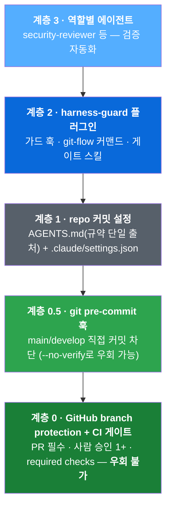
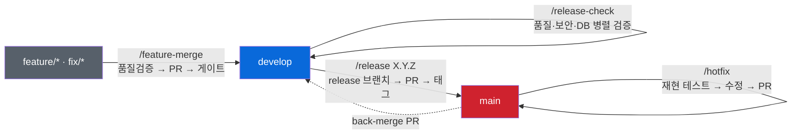

# team-harness

> **팀을 위한 AI 코딩 거버넌스 — 합의는 문서 한 곳에, 강제는 서버에.**


5–10명이 각자의 방식으로 AI 코딩 도구를 쓰면, 코드 편차는 AI 도입 전보다 오히려 커진다.
이 repo는 그 문제를 세 가지 축으로 푼다:

1. **Claude Code 플러그인 마켓플레이스** — 가드·커맨드·절차를 버전 있는 플러그인으로 배포
2. **repo 커밋 설정** — 규약의 단일 출처(`AGENTS.md`)를 도구 무관하게 공유
3. **git / CI 강제** — branch protection과 CI 게이트로 "지킬 수밖에 없는" 구조를 서버에 설치

핵심 통찰은 단순하다. **AI에게 "부탁"하는 규칙은 강제가 아니다.** 프롬프트와 훅은 우회될 수 있고,
도구마다 동작이 다르다. 그래서 강제력의 원천을 GitHub(서버)까지 내려보내고, 위 계층은
그 위에서 *편의와 자동화*를 제공하도록 역할을 나눈다.

---

## 강제 계층 — Defense in Depth

아래로 내려갈수록 강제력이 세지고, AI 도구 중립적이 된다.



| 계층 | 강제 대상 | 위치 |
|---|---|---|
| 0 — branch protection + CI 게이트 | **모든 사람 · 모든 AI 도구** | GitHub (`templates/ci/`) |
| 0.5 — git pre-commit 훅 | 모든 사람 · 모든 AI 도구 | 각 repo `.githooks/` (`templates/githooks/`) |
| 1 — AGENTS.md + `.claude/` 커밋 설정 | repo를 clone한 전원 | 각 프로젝트 repo (`templates/`) |
| 2 — harness-guard 플러그인 | Claude Code 사용자 | 이 repo (`plugins/`) |
| 3 — 역할별 named agents | Claude Code 사용자 | 플러그인 + 프로젝트 `.claude/agents/` |

> Claude Code가 아닌 도구를 쓰는 팀(기획·마케팅 등)도 `AGENTS.md` 하나만 보면 된다 —
> Codex는 네이티브로 읽고, Gemini CLI는 contextFileName 설정으로 읽는다.
> 계층 2–3은 못 쓰더라도 **계층 0은 도구와 무관하게 전원에게 강제된다.**

## repo 구조

```
team-harness/
├── .claude-plugin/marketplace.json    사내 마켓플레이스 카탈로그
├── .githooks/pre-commit               계층 0.5 가드 — 이 repo 자체에도 적용 (dogfooding)
├── plugins/harness-guard/             플러그인 본체 (아래 상세)
├── templates/                         신규 프로젝트에 복사하는 파일들
│   ├── AGENTS.md · CLAUDE.md          규약 단일 출처 + Claude 전용 지침
│   ├── settings.json                  .claude/settings.json (마켓플레이스·플러그인 선언)
│   ├── ci/ci-gate.yml · ai-review.yml CI 품질 게이트 + AI 리뷰(claude-code-action)
│   ├── githooks/pre-commit            계층 0.5 git 훅
│   └── PULL_REQUEST_TEMPLATE.md · gitignore.snippet
└── docs/                              팀 표준 문서 (아래 표)
```

## harness-guard 플러그인

공식 플러그인이 제공하지 않는 **자체 정책만** 담는다.

| 구성 요소 | 내용 |
|---|---|
| **가드 훅** (PreToolUse) | `guard.sh` — main/develop 직접 커밋·force push, `git reset --hard`, 핵심 디렉터리 `rm -rf`, npm 글로벌 설치 차단 (`cd` 체인·서브셸·`git -C` 우회 포함, 보조 장치 — 최종 강제는 계층 0). + LLM 프롬프트 훅 — 시크릿 외부 유출 패턴 전용 탐지 |
| **커맨드 4종** | `/feature-merge` · `/hotfix` · `/release-check` · `/release` — git-flow 전 구간을 게이트 경유로 자동화. 빌드·테스트 명령은 각 repo의 AGENTS.md에서 읽는다 |
| **스킬** `pr-review-gate` | PR 생성→머지의 표준 게이트 절차 **단일 출처** — AI 리뷰 스레드 reply+resolve, 사람 승인 확인, CI watch, 외부 배포 commit-status 검증 |
| **에이전트** `security-reviewer` | 릴리즈 전 보안 검토(XSS·SQL 인젝션·하드코딩 시크릿·.env 추적) — 읽기 전용, opus |

### git-flow와 커맨드의 관계



모든 경로는 PR을 경유하고, 머지 전에 `pr-review-gate`의 게이트
(AI 리뷰 처리 → **사람 승인** → CI → 외부 배포 상태)를 통과해야 한다.
AI 리뷰와 CI 통과는 사람 승인을 대체하지 않는다.

## 빠른 시작

### 팀원 온보딩 (각자 1회, ~3분)

```bash
git clone <프로젝트-repo>             # .claude/ 포함 — 커맨드·권한 컨벤션 자동 적용
cd <프로젝트-repo>
git config core.hooksPath .githooks   # git 네이티브 가드 활성화
claude                                # 첫 실행 시 marketplace/plugin 신뢰 확인 → 설치
```

개인 설정은 `.claude/settings.local.json`에만 (gitignore됨).

### 신규 프로젝트 셋업 (리드 1회)

`templates/` 복사 → CI를 스택에 맞게 교체 → **CI가 실제로 통과하는 것을 확인한 뒤**
branch protection을 main·develop 양쪽에 적용. 순서가 중요하다 — placeholder CI는 항상
실패하도록 만들어져 있어서, 교체 전에 protection을 걸면 첫 PR부터 머지가 막힌다.
전체 체크리스트와 `gh api` 일괄 적용 명령: [`docs/onboarding.md`](docs/onboarding.md)

### 로컬 테스트 (플랜 불필요)

```
/plugin marketplace add /path/to/team-harness
/plugin install harness-guard@team-harness
```

main 브랜치에서 `git commit` 시도 → ⛔ 차단되면 정상.

## 팀 표준 문서 (`docs/`)

| 문서 | 내용 |
|---|---|
| [onboarding.md](docs/onboarding.md) | 신규 프로젝트 셋업 · 팀원 온보딩 · managed settings 로컬 시뮬레이션 |
| [stack-guide.md](docs/stack-guide.md) | 기술 스택 선택 가이드 (SCM·ERP·업무 자동화 기준) |
| [architecture-infra.md](docs/architecture-infra.md) | 레포 전략 · 모듈러 모놀리스→미니서비스 · GitOps · 인프라 |
| [clean-architecture.md](docs/clean-architecture.md) | 1차 경계=도메인 모듈, 2차 경계=내부 계층 |
| [api-standards.md](docs/api-standards.md) | 공통 Envelope · 에러코드 체계 · 페이지네이션 |
| [db-standards.md](docs/db-standards.md) | BIGINT PK+채번 · 공통 감사 컬럼 · forward-only 마이그레이션 |
| [auth-standards.md](docs/auth-standards.md) | Keycloak OIDC · RBAC 권한코드 + 데이터 스코프 |
| [code-review.md](docs/code-review.md) | Conventional Commits(타입 영어+본문 한국어) · 리뷰어 배정 규칙 |
| [ai-collaboration.md](docs/ai-collaboration.md) | AI 협업 책임 원칙 · 도구 공통 금지사항 |
| [operations.md](docs/operations.md) | 장애 대응 · 로그 레벨 기준 · traceId 전파 (서비스 오픈 시 활성화) |
| [decisions.md](docs/decisions.md) | 확정 결정의 단일 출처 — 결정·정본 문서·영향 문서 |
| [harness-maintenance.md](docs/harness-maintenance.md) | 하네스 자체 변경 절차 · 플러그인 버전 정책 · 전파 방식 |

## 운영 원칙

- **배포는 파일 복사가 아니라 플러그인 버전 배포로.** 공통 거버넌스가 바뀌면 플러그인 버전을
  올린다 — 프로젝트별 동기화 스크립트·버전 마커가 필요 없다.
- **스택/프로젝트별 변형은 플러그인에 넣지 않는다.** 전용 가드·검증 훅은 각 프로젝트
  `.claude/settings.json`에 커밋한다 (플러그인 훅과 공존).
- **추측성 선행 작성 금지.** 문서 체계는 프로젝트 시작 전 단계로는 완결 상태다.
  아래 시점이 오면 그때 해당 문서를 추가한다:

| 트리거 | 추가할 문서 |
|---|---|
| **스택 확정** | 스택 스캐폴드(AGENTS.md 빌드·테스트 명령 구체화, ci-gate 실제 단계, 스택 전용 가드 훅), 테스트 표준(픽스처·커버리지·e2e 범위), 프론트엔드 컨벤션, 환경변수·설정 프로파일 규약 |
| **도메인 설계 시작** | 용어집(유비쿼터스 랭귀지), 공통코드·기준정보 거버넌스 |
| **팀원 합류** | 로컬 개발환경 가이드(docker compose·시드 데이터 — 프로젝트 repo에) |
| **서비스 오픈** | SLO·성능 기준, 온콜 로테이션 실명화 (`operations.md` 활성화) |

## 현재 제약 (2026-06 기준)

- Team/Enterprise 플랜 없음 → 서버 managed settings 불가 → **계층 0이 유일한 하드 강제**
- 실험 기능(agent teams 등) 미사용
- 팀별 단일 AI 도구: 개발팀 = Claude Code, 타 팀은 Codex/Gemini 가능 → 규약 공유는 AGENTS.md로

## 로드맵

- [x] v0.1 스캐폴딩 — 마켓플레이스 + harness-guard(가드·게이트·커맨드·에이전트) + 템플릿 + 온보딩
- [x] 로컬 마켓플레이스 설치·가드 실동작 검증 (cd 우회 차단, settings 키 포맷 스키마 대조)
- [x] 파일럿 리허설 — 온보딩 절차 풀 드릴, 발견 사항 반영
- [x] GitHub push (개인 private repo, 임시) + 문서 체계 구축
- [x] 팀 환경 정합화 — back-merge PR 절차, 사람 승인 게이트, AI 리뷰(claude-code-action) 연결
- [ ] 첫 회사 프로젝트: 스택 확정 → 스캐폴드(AGENTS.md·CI 구체화) → 계층 0~2 풀 적용
- [ ] 사내 git 호스팅으로 이전, 템플릿의 마켓 주소 교체
- [ ] (플랜 도입 시) server-managed settings로 권한 강제 / (GA 시) agent teams 재검토
