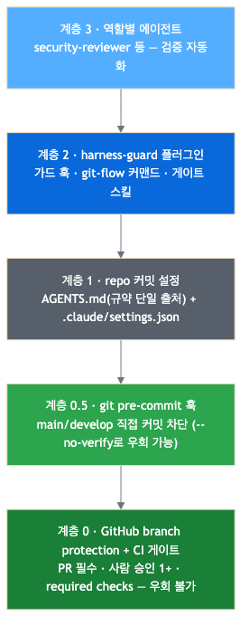
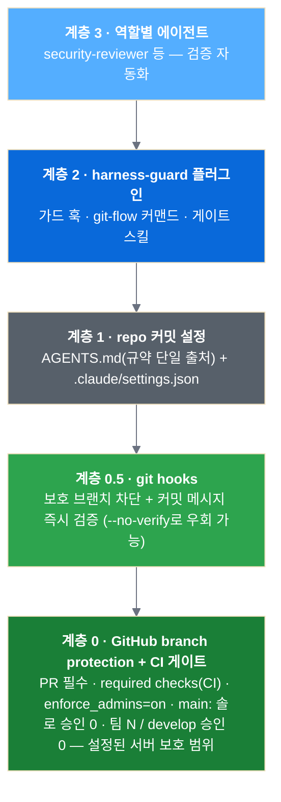

# Harness 강제 계층

[README로 돌아가기](../README.md). 이 문서는 해당 주제의 상세 정본이다.

## 🏗️ 아키텍처

아래로 내려갈수록 강제력이 세지고, AI 도구 중립적이 된다.

이 PNG는 사람 승인 1+를 일률적으로 표시한 과거 팀 모드 그림이다. 원본을 보존하며 현재 정책은
아래 Mermaid와 [리뷰·브랜치 정책](code-review.md)을 따른다. 솔로 승인 0, 팀 main 승인 N,
develop 승인 0의 설정을 구분한다.

mermaid 소스 (GitHub 웹에선 차트로 렌더)

| 계층 | 강제 대상 | 위치 |
|---|---|---|
| 0 — branch protection + CI 게이트 | **설정된 보호·bypass 범위의 모든 사용자·도구** | GitHub (`templates/ci/`) |
| 0.5 — git pre-commit·commit-msg 훅 | 모든 사람 · 모든 AI 도구 | 각 repo `.githooks/` (`templates/githooks/`) |
| 1 — AGENTS.md + `.claude/` 커밋 설정 | repo를 clone한 전원 | 각 프로젝트 repo (`templates/`) |
| 2 — harness-guard 플러그인 | Claude Code·Codex 사용자 | 이 repo (`plugins/`) |
| 3 — 역할별 named agents | Claude Code·Codex 사용자 | 플러그인의 runtime별 agent 설정 |

> Claude Code가 아닌 도구를 쓰는 팀(기획·마케팅 등)도 `AGENTS.md` 하나만 보면 된다 —
> Codex는 네이티브로 읽고, Gemini CLI는 contextFileName 설정으로 읽는다.
> 계층 2–3은 못 쓰더라도 **계층 0은 도구와 무관하게 설정된 서버 정책을 집행한다.**

`--no-verify`는 로컬 hook만 건너뛴다. PR·required checks·관리자 적용·bypass 예외의 실제 서버
설정을 확인해야 하며, 다이어그램만으로 모든 권한·설정에서 우회 불가라고 주장하지 않는다.

## 현재 Git 흐름과 보존 그림

[과거 Git 흐름 PNG](architecture-gitflow.png)는 develop에서 `/loop`로 이어지는 기존 그림을 보존한
역사적 자료다. 현재 반복 수정·체크포인트 커밋은 작업 브랜치에서 한다. 자연어 자동 선택은 명시적
commit 요청 없이 커밋하지 않으며 보호 브랜치의 `--no-commit` 실행은 커밋을 남기지 않는다.

현재 정본은 [플러그인의 Mermaid와 흐름 안내](harness-plugin.md#git-flow와-커맨드의-관계)다.
`main → hotfix/* → 수정·검증 → main PR → 태그 → develop 역병합 PR`을 거치며,
보호 브랜치에 직접 커밋·push하는 흐름으로 표시하지 않는다.
모델·effort는 [native 선택과 실행 상태](model-tiering.md)를 따른다. 소스 후보의 선언과 실제 실행
검증을 구분하고 Claude OAuth 갱신 후 재개할 검사를 완료로 표시하지 않는다.

---
