# Team Harness 아키텍처 — 요청부터 보호된 병합까지

[README로 돌아가기](../README.md). 개발자가 훅·검증·PR·CI·브랜치 보호의 관계를 읽는 안내다.



## 그림 읽기

기본 경로는 작업 브랜치의 변경을 커밋하고 PR을 만든 뒤, 현재 후보의 검증·CI·리뷰 결과를 대조해
병합을 요청하는 흐름이다. 검증 증거는 단순히 한 번 통과한 기록이 아니라 해당 후보와 연결돼야 한다.

| 담당 | 역할 | 원본 |
|---|---|---|
| Codex·Claude | 스킬 선택, 훅·에이전트 실행, sandbox·권한 관리 | [플랫폼 위임 범위](product-direction.md#실행-플랫폼에-위임하는-것) |
| 저장소 규약·단계 안내 | AGENTS와 스택 규칙을 읽고 작업한다. route-intent는 다음 Git 단계를 제안한다. | [AI 협업·스킬 선택](ai-collaboration.md#skill-실행과-가시성) |
| PreToolUse 가드 | 대상 명령의 보호 브랜치 작업·위험 패턴·시크릿 전송을 검사한다. | [플러그인 훅](harness-plugin.md) |
| 로컬 Git 훅 | 활성화된 pre-commit·commit-msg가 커밋과 시크릿·메시지 형식을 검사한다. | [커밋 규칙](code-review.md) |
| 검증 증거 | 요구·테스트·독립 리뷰·완료 범위를 현재 작업트리와 커밋에 연결한다. | [완료 검증 계약](../plugins/harness-guard/skills/verification-before-completion/SKILL.md) |
| PR 생성 래퍼 | 문서 선언과 커밋 상태를 확인하고 작업 브랜치를 push해 PR을 만든다. | [pr-create.sh](../plugins/harness-guard/scripts/pr-create.sh) |
| CI·리뷰 상태 | GitHub에서 필수 검사 결과와 리뷰 스레드 상태를 조회할 수 있다. | [품질 workflow](../.github/workflows/ci-gate.yml) |
| PR 병합 래퍼 | CI·미해결 스레드·충돌·후보 변경을 검사하고 검증한 head로 병합을 요청한다. | [pr-merge.sh](../plugins/harness-guard/scripts/pr-merge.sh) |
| GitHub 브랜치 보호 | 설정된 PR·필수 검사·승인·관리자 적용과 bypass 범위의 서버 정책을 집행한다. | [리뷰·브랜치 정책](code-review.md#pr-규칙) |

## 훅과 보호 범위

Claude의 PreToolUse에는 공유 guard.sh와 시크릿 전송 탐지용 prompt 훅이 있다.
Codex는 codex-pretool-guard.mjs가 명령 입력을 정규화하고 공유 가드와 전송 가드를 실행한다.
두 도구 모두 UserPromptSubmit에서 route-intent.mjs를 연결한다. 이 안내는 실행 권한을 추가하지 않는다.
현재 배포 단위는 **harness-guard 플러그인 하나**다. staged core·adapter·workflow는 별도 설치 완료 상태가 아니다.

Git 훅은 설치·활성화된 로컬 경로에 적용된다. --no-verify는 로컬 훅을 건너뛸 수 있지만 GitHub의
필수 검사는 그대로 남는다. 도구 훅 연결 선언과 현재 호스트에서 실제 훅이 발화했다는 증거도 구분한다.

기본 정책은 develop 승인 0, main은 솔로 승인 0 또는 팀 승인 N이다. 승인요건 유지와 solo-merge를
선택하는 운영도 있으므로 **실제 저장소 보호 설정**을 확인한다. 그림은 모든 권한에서 우회 불가를 보장하지 않는다.
pr-merge.sh --auto는 develop 전용이며 필수 검사 없음·조회 실패를 거부한다. 수동 경로의
필수 검사 없음·Actions fallback 조건은 [리뷰 규칙과 후보 결박](code-review.md#검토-후보보호-복원태그-연결)을 따른다.

## HTML 보기와 재생성

- [상세 HTML 내려받기](diagrams/team-harness.html): 파일로 저장해 브라우저에서 연다. GitHub 파일 화면은 HTML을 실행하지 않는다.
- [원본 JSON](diagrams/team-harness.json): 구성·연결·설명 카드·커밋과 소스 줄 참조를 담는다.
- [정적 SVG 추출기](diagrams/export-svg.py): HTML을 실행하지 않고 밝은 테마의 SVG를 추출한다.

그림과 설명은 한국어다. Archify의 고정 Viewer 조작 UI와 HTML 언어 표시는 영어 기본값이다.
상세 HTML은 출처를 열거나 Export에서 이미지를 저장할 수 있다. 독립 HTML의 핵심 보기는 서버가 필요 없다.
README SVG는 정적 표시용이며 HTML의 설명 카드는 위 본문에서도 읽을 수 있다.

생성 도구는 [공식 Archify](https://github.com/tt-a1i/archify), 사용 버전은 3.0.1이다.
고정 소스는 58ab0b98d2d0def8e49dced705c7b566936723ec이며 전역 플러그인·스킬 설치를 요구하지 않는다.
준비 조건은 Node.js 18+, Chrome/Chromium(finalize 브라우저 검사), Python 3(SVG 추출)다.
공식 소스를 별도 경로에 준비한 뒤 저장소 루트에서 실행한다.

```bash
ARCHIFY_ROOT='../archify-tool/archify' # 위 고정 commit의 공식 checkout
node "$ARCHIFY_ROOT/bin/archify.mjs" finalize architecture \
  docs/diagrams/team-harness.json docs/diagrams/team-harness.html \
  --repo-root . --quality showcase --json --out-dir /tmp/harness-diagram-check
python3 docs/diagrams/export-svg.py \
  docs/diagrams/team-harness.html docs/diagrams/team-harness.svg
```

JSON의 meta.output은 최초 제작 폴더를 보존한다. 위 CLI 출력 인자로 현재 문서 경로를 지정한다.
소스 참조는 JSON에 고정한 커밋의 바이트를 검증한다. 동작을 바꿨으면 해당 커밋과 줄 범위를 함께 갱신한다.
기존 HTML의 브라우저 검사 기록이 있으면 새 evidence 폴더로 검사한다. 검사 통과와 실제 이미지 검토는 별개다.
Archify와 포함 폰트의 고지는 [MIT](diagrams/ARCHIFY-LICENSE.txt)·[OFL](diagrams/JetBrainsMono-OFL.txt)을 보존한다.

## 현재 Git 흐름과 역사 자료

반복 수정과 커밋은 작업 브랜치에서 한다. feature/fix는 develop PR을 거치며 release·hotfix도 보호
브랜치에 직접 커밋·push하지 않는다. [Git 흐름의 상세 안내](harness-plugin.md#git-flow와-커맨드의-관계)를 따른다.
모델·effort와 실행 상태는 [모델 안내](model-tiering.md)를 따른다.

[과거 아키텍처 PNG](architecture.png)는 사람 승인 1+를 일률적으로 표시했던 팀 모드 자료다.
[과거 Git 흐름 PNG](architecture-gitflow.png)는 develop에서 loop로 이어지던 자료다. 두 원본을 역사 자료로 보존한다.
