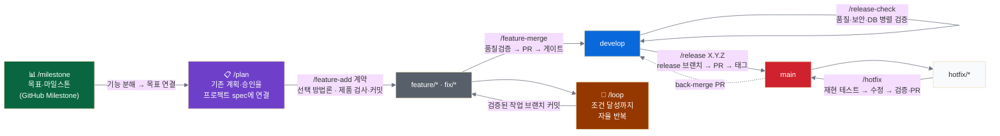

# Harness 플러그인과 Git 흐름

[README로 돌아가기](../README.md). 이 문서는 해당 주제의 상세 정본이다.

## harness-guard 플러그인

공식 플러그인이 제공하지 않는 **자체 정책만** 담는다.

현재 설치 단위는 호환성을 위해 `harness-guard` 하나다. 다음 배포 단계에서 사용할 governance core,
Claude·Codex adapter, 선택 workflow의 파일 소속과 manifest는 `packaging/packages.json`이 정본이며 아래 명령으로
clean 디렉터리에 재현 가능한 staged artifact를 만들 수 있다. 이 artifact는 아직 marketplace 설치 대상이 아니다.

```bash
node scripts/build-packages.mjs --check
node scripts/build-packages.mjs --output /tmp/team-harness-packages
```

| 구성 요소 | 내용 |
|---|---|
| **가드 훅** (PreToolUse) | `guard.sh` — main/develop 직접 커밋·force push, `git reset --hard`, **검증기·마이그레이션 삭제**, 핵심 디렉터리 `rm -rf`, npm 글로벌 설치, **맨손 `gh pr create`·`gh pr merge`**(PR 생성·머지는 래퍼 스크립트=스킬 경유만 — 반사적 우회 차단) 차단 (`cd` 체인·서브셸·`git -C` 우회 포함, 보조 장치 — 최종 강제는 계층 0). **차단 시 `~/.claude/hooks/guard-block.log`에 session_id·cwd·명령(크레덴셜·토큰 마스킹) 기록**(멀티세션 위반 시도 감사). + LLM 프롬프트 훅 — 시크릿 외부 유출 패턴 전용 탐지 |
| **PR 래퍼 스크립트** | `pr-create.sh`(base 자동감지·push·생성) · `pr-merge.sh`(CI·스레드·mergeable 게이트 후 머지) — guard가 맨손 gh를 막으므로 **PR 생성·머지의 유일 경로**. 스킬이 이 스크립트를 호출(내부 gh는 자식 프로세스라 훅에 안 걸림) |
| **skill 자동 선택 + 의도 라우터** | 일반 자연어 작업은 17개 description의 사용·제외 경계로 runtime이 implicit selection. `route-intent.mjs`는 "진행해"처럼 이미 시작된 Git/PR 작업의 다음 상태만 결정한다. substring 키워드 주입과 권한 확대는 하지 않는다. |
| **마일스톤 커맨드** | `/milestone` — 제품·마일스톤 정의→기능 분해→GitHub 마일스톤 생성→진행률 대시보드. `/plan` 위에 놓이는 목표 레이어. Claude Code 내장 `/goal`(세션 stopping condition)과 보완 관계 |
| **계획 계약** | `/plan` — 선택된 방법론의 계획·승인을 프로젝트 spec·수용 기준에 연결. 기존 계획을 재사용하고 Git은 변경하지 않음 |
| **개발 계약** | `/feature-add` · `/feature-modify` — 선택된 구현 방법론에 테스트 무결성·AGENTS.md 검사·제품 커밋 규약을 연결 |
| **진단 계약** | `/systematic-debugging` — 선택된 진단 방법에 프로젝트 재현 증거·무수정 경계를 연결. 원인 확인과 수정 승인 후 구현 계약으로 인계 |
| **완료 검증 스킬** | `/verification-before-completion` — 현재 worktree·HEAD에 유효한 증거로 검증하며 같은 후보·환경·범위의 결과를 재사용. 변경·gate 신선도 조건에는 재검사, 실패·미확인은 fail-closed |
| **자율 루프 커맨드** | `/loop` — 동기 조건-루프. CI·lint·테스트 등 "통과할 때까지 즉시 반복" 작업을 timeout·max·내용 기반 stuck·안전 checkpoint 안에서 자동화. 맥락 자동 선택은 명시적 요청 없이 commit하지 않으며 시간 예약 polling과 별개 |
| **품질 커맨드** | `/qa` — 프론트엔드 QA: 디자인 토큰 준수 + WCAG 2.2 접근성 검증 (`/feature-add`의 TDD 로직과 직교한 비주얼·a11y 축) |
| **릴리즈 검증** | `/release-check` — 릴리즈 전 품질(Agent A)·보안(Agent B)·DB 마이그레이션(Agent C) 병렬 검증 + manifest가 있을 때 외부 파일럿 live provenance |
| **드리프트 점검** | `/repo-sync` — 프로젝트 ↔ team-harness 표준 드리프트 점검(`check-repo-sync`). commit-msg·validator·CI·rules 등 필수 자산 누락 리포트 |
| **PR 생성** | `/pr-create` — base 자동감지(develop 있으면 develop, 없으면 기본 브랜치) PR 생성 **단일 프리미티브**. 맨손 `gh pr create` 대체 — develop 없는 main 기반 repo도 한 경로로. `feature-merge`가 PR 생성 단계를 이 스킬에 위임 |
| **머지·릴리즈 커맨드** | `/feature-merge` · `/hotfix` · `/release` · `/solo-merge` — git-flow 전 구간을 게이트 경유로 자동화 |
| **스킬** `pr-review-gate` | PR 생성→머지의 표준 게이트 절차 **단일 출처** — AI 리뷰 스레드 reply+resolve, 사람 승인 확인, CI watch, 외부 배포 commit-status 검증 |
| **에이전트** `security-reviewer` | 릴리즈 전 보안 검토 기준 — Claude agent로 제공하고 Codex 실행·모델 선택은 native agent에 위임 |
| **에이전트** `verifier` | 검증·연구·설계 반증 기준 — Claude agent로 제공하고 Codex 실행·모델 선택은 native agent에 위임 |

### git-flow와 커맨드의 관계



흐름: `/milestone`(목표·마일스톤 정의) → `/plan`(기존 계획·승인을 프로젝트 spec에 연결) → **`feature/*` 한 브랜치**에서 선택한 방법론과 `/feature-add` 프로젝트 계약 →
`/feature-merge`(한 PR). *한 기능 = 한 브랜치 = 한 PR.*
`/loop`: 작업 브랜치에서 CI·lint·테스트 등 반복 수정을 exit 0까지 동기 자율 실행. 자연어 맥락으로 자동
선택되면 명시적 commit 요청이 없는 한 검증된 변경을 작업트리에 둔다.
내장 `/goal`(세션 stopping condition)·`/loop`(ScheduleWakeup 비동기)는 별도 유지.

모든 경로는 PR을 경유하고, 머지 전에 `pr-review-gate`의 게이트
(AI 리뷰 처리 → CI → 외부 배포 상태, **팀 모드는 + 사람 승인**)를 통과해야 한다.
**솔로 표준**(승인요건 0)에선 사람 승인 단계는 생략된다. wrapper가 CI·스레드 resolve를 확인하고,
설정된 GitHub 보호의 required checks·enforce_admins가 서버에서 CI-green을 강제한다(pr-review-gate §4).
실제 보호 설정·허용된 예외·직접 API 권한도 확인해야 하며, 문구나 로컬 hook만으로 우회 불가를 보장하지 않는다.
팀은 `set-branch-protection.sh --approvals N`으로 main에 리뷰 승인 요건을 추가한다(develop은 0 유지).

---
