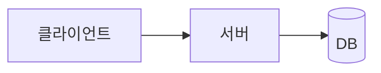

# README 표준 — 프로젝트 repo README 양식

> 모든 프로젝트(grinvi04 산하)의 루트 `README.md`가 따르는 단일 양식.
> 채워 쓰는 골격은 [`templates/README.template.md`](../templates/README.template.md).
> 목적: README만 보고 **무엇인지·왜 필요한지·어떻게 10분 안에 돌리는지**가 한눈에 들어오게.

기존 repo(team-harness·DriveTree·siku·webhook-service)의 공통 패턴 + 오픈소스 관례
([makeareadme](https://www.makeareadme.com/) · [standard-readme](https://github.com/RichardLitt/standard-readme))를
합쳐 정의한다.

---

## 1. 섹션 순서 (필수 ★ / 선택 ○)

| ★/○ | 섹션 | 내용 |
|---|---|---|
| ★ | **헤더** | `# {이모지} 제목 — 한 줄 요약` |
| ★ | **태그라인** | `> **"왜 이 프로젝트가 필요한가"를 한 문장**` (blockquote) + 소개 1~2문장(스택·상세 링크) |
| ★ | **뱃지** | CI · Tests · Live/배포상태 · License · version · 주요 스택 (shields.io) |
| ○ | **📸 스크린샷** | 데모/캡처. 인증 화면이면 placeholder + 추가 예정 명시 |
| ★ | **✨ 주요 기능** | 표(`기능 \| 설명`), 행마다 이모지 |
| ★ | **🧱 기술 스택** | 표(`영역 \| 스택`) |
| ★ | **🏗️ 아키텍처** | **정적 이미지(`docs/architecture.png`) + mermaid 소스(`<details>`)** + 핵심 원칙 bullet |
| ★ | **🚀 시작하기** | copy-paste 가능한 **번호 단계**(<10분 목표). 풀스택이면 인프라→백→프론트. **테스트 계정** 포함 |
| ★ | **🧪 테스트** | lint·test·build·e2e 명령 |
| ○ | **📁 디렉토리** | 트리(주석) |
| ★ | **📚 참고 문서** | `AGENTS.md` · team-harness 표준 · `docs/specs` |
| ★ | **📄 라이선스** | `License © 소유자` |

> 섹션 5개 이상이면 헤더 아래 **목차**를 둔다(긴 README 한정). 짧으면 생략.

## 2. 스타일 규칙

- **한국어**. 섹션 헤더에 이모지 **절제 사용**(섹션당 1개, 장식 남발 금지).
- **태그라인은 가치 한 문장** — 기능 나열이 아니라 "왜"를. (예: siku "모임의 기록·사진·정산을 한 곳에서")
- **뱃지는 실제 상태를 반영**. 미배포면 `deploy-local%20only` 처럼 **사실대로**(과장·거짓 금지). 테스트 뱃지는 실제 개수.
- **아키텍처는 mermaid + 이미지 폴백**(코드블록 ASCII 아님). 요청 흐름 또는 계층 구조를 그린다. mermaid는 **github.com 웹에서만** 렌더되므로 정적 이미지를 1차로 두고 mermaid 소스는 `<details>`에 둔다(§4).
- **시작하기는 copy-paste 그대로 동작**해야 한다 — 실제로 한 번 돌려 검증한 명령만 적는다. 포트·계정·env를 정확히.
- **거짓·과장 금지** — 미배포·미구현·알려진 한계를 정확히. (운영 표준 `operations.md` "liveness ≠ freshness"와 같은 정신.)
- 줄당 한 문장, 표는 정렬. `---` 구분선은 선택.

## 3. Do / Don't

- ✅ 클론 후 **10분 내 실행**되게 — 전제(Docker·런타임 버전)·정확한 명령·테스트 계정.
- ✅ README는 **현재 상태의 단일 출처** — 코드/배포가 바뀌면 같은 PR에서 README도 갱신.
- 🚫 동작 안 하는 "Getting Started"(포트 오기·누락 단계) — 따라 했을 때 막히면 README 실패.
- 🚫 시크릿·실 토큰·실 비밀번호 커밋(테스트 계정의 더미 비밀번호는 OK, 실 시크릿은 `.env`·gitignore).
- 🚫 장식용 이모지·뱃지 남발, 빈 "TODO" 섹션.
- 🚫 아키텍처를 **mermaid 코드펜스만** 두기 — github.com 외 뷰어(IDE·모바일·raw)에선 원문 텍스트로 노출된다. 이미지 폴백 동반(§4).

## 4. 아키텍처 다이어그램 — mermaid + 이미지 폴백

mermaid 코드펜스(```` ```mermaid ````)는 **github.com 웹에서만** 차트로 렌더된다. IDE 미리보기(VS Code·JetBrains)·모바일 앱·"Raw" 보기·기타 마크다운 뷰어에선 **원문 텍스트가 그대로 노출**된다(mermaid JS 미실행). 따라서 🏗️ 아키텍처는 **정적 이미지를 1차로 보여주고, mermaid 소스는 `<details>`에 둔다** — 어디서나 보이게.

`````markdown
## 🏗️ 아키텍처


<details>
<summary>mermaid 소스 (GitHub 웹에선 차트로 렌더)</summary>



</details>

- **<핵심 원칙 1>** — <설명>
`````

**이미지 생성**(mermaid → PNG): `@mermaid-js/mermaid-cli`(mmdc)로 렌더한다. Playwright가 설치된 repo면 그 chromium이 재사용돼 별도 설치가 거의 필요 없다.
```bash
npx -y @mermaid-js/mermaid-cli -i arch.mmd -o docs/architecture.png -b white -w 1600
```
- **흰 배경 PNG**(`-b white`) = 다크모드 GitHub에서도 텍스트가 보인다.
- 다이어그램을 바꾸면 **같은 PR에서 이미지도 재생성**한다(README는 현재 상태의 단일 출처).
- mermaid 라벨 줄바꿈은 `\n`이 아니라 **`<br/>`** — GitHub mermaid(v10+)는 `\n`을 줄바꿈으로 처리하지 않아 원문이 그대로 찍힌다.

## 5. 적용

- 새 프로젝트: `templates/README.template.md`를 루트 `README.md`로 복사해 채운다.
- 기존 프로젝트: 다음 README 손볼 때 이 순서·스타일로 정렬(전면 재작성 강요 아님 — 외과적).
