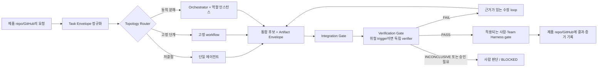

# Team Harness 개발 조정 아키텍처

현재 정본은 Team Harness의 선택형 개발 조정 모듈이다. 계약과 로컬 선언 검사만 제공하며 native 권한·격리·성능 비교를 보장하지 않는다. 적용은 [사용 안내](usage.md), 기존 실행 증거는 [이관 이력](history.md)을 따른다.

## 1. 제품 목표

Team Harness의 개발 조정 모듈은 여러 개발자가 LLM으로 백엔드·프론트엔드·인프라 업무를 수행할 때 사용하는 **공통 개발 협업 기반**이다. 작업에 필요한 실행 형태와 전문 기능을 선택하고, 소유권·인수인계·검증을 재현 가능하게 하는 계약과 조정 절차를 제공한다. [공통 기반과 프로젝트별 적용](product-direction.md#공통-기반과-프로젝트별-적용)에 회사 정책·기술 지침·제품 원본과의 책임 경계를 정리했다.

목표는 다음과 같다.

1. Product, UX/Design, Architecture/PL, 구현, QA/QC, Security, Operations/Incident 기능을 책임·입력·출력·권한·완료 조건으로 정의한다.
2. 단일 에이전트, 고정 workflow, Orchestrator-workers, evaluator-optimizer 중 가장 단순한 충분한 형태를 작업 특성에 맞게 선택한다.
3. 역할 간 전달 내용을 채팅 기억이 아니라 명시적인 작업·산출물 계약으로 만든다.
4. 병렬 작업의 파일·결정 소유권과 격리 조건을 정의한다.
5. 구현자가 만든 결과를 원본과 외부 판정으로 다시 검사하고, 실패·재시도·중단을 숨기지 않는다.
6. 동일 조건의 반복 평가로 품질, 전체 완료 시간, 사람 개입, 재작업, 비용, 운영 안정성을 비교한다.
7. Codex와 Claude Code의 native 기능을 우선 사용하면서도 역할 의미는 플랫폼 중립적으로 유지한다.

## 2. 비목표

다음은 이 모듈이 맡지 않는다.

- 제품 코드, 제품별 요구사항, 도메인 지식, ADR, 이슈, 백로그, 실행 상태의 중앙 저장
- Team Harness core가 담당하는 GitHub 정책, 권한, 품질 gate, 리뷰, 릴리즈, 감사 체계의 복제
- 모든 직책마다 영구 에이전트나 영구 채팅을 유지하는 조직 시뮬레이션
- 모든 요청을 멀티에이전트로 처리하거나 병렬화하는 규칙
- 범용 장기 실행 서버, 대시보드, scheduler, 메시지 버스의 선제 개발
- 특정 모델, 공급자, 비공개 추론 내용에 의존하는 계약
- 연구·비코딩 벤치마크 수치를 제품 개발 성능으로 일반화하는 주장
- 사람의 제품 판단, 법적 승인, 운영상 비가역 결정의 자동 대체

## 3. 설계 전제와 검증할 가설

### 플랫폼 조사 기록 (2026-09-05)

아래는 당시 공식 원문 확인 기록이다. 2026-09-20 문서 정리에서는 플랫폼 기능을 새로 시험하거나 현재 지원 상태를 재확인하지 않았다. 새 실행 전에는 해당 호스트와 최신 공식 문서에서 필요한 항목을 다시 확인한다.

- Codex는 프로젝트 범위 custom agent와 subagent를 지원한다. custom agent의 read-only 설정이 있어도 부모 turn의 live sandbox·approval override가 재적용될 수 있으므로 파일만 보고 유효 권한을 단정하지 않는다. Codex app worktree는 Git 저장소를 전제로 한다.
- Claude Code는 프로젝트 범위 custom subagent, 도구·권한·skill 설정, subagent별 worktree 격리를 지원한다. 다만 subagent `permissionMode`는 부모 mode와 조직 설정에 따라 상속되거나 override가 무시될 수 있어 실제 deny test가 필요하다.
- Codex subagent와 Claude Code agent team은 단일 실행보다 추가 token/context·조정 비용을 만든다고 공식 문서에서 설명한다.
- Claude Code agent teams는 현재 실험 기능이며 기본적으로 꺼져 있고, subagent보다 더 무거운 조정 형태다.

### 아직 검증하지 않은 설계 가설

1. 저위험·저결합 작업은 강한 단일 에이전트가 가장 효율적일 가능성이 높다.
2. 단계와 판정 기준이 안정적인 작업은 고정 workflow가 동적 위임보다 예측 가능할 가능성이 높다.
3. 작업 분해가 입력마다 달라지는 교차 경계 작업은 얇은 Orchestrator와 전문 worker가 재작업 또는 전체 시간을 줄일 수 있다.
4. 독립 verifier는 구현자의 자기검사만 사용할 때보다 중대한 누락을 더 자주 발견할 수 있지만, 동일 모델·동일 공급자를 쓰면 오류 상관관계가 남는다.
5. 역할 계약과 구조화된 인수인계가 추가하는 비용은 단순 작업에서는 이득보다 클 수 있다.

이 가설들의 판정 방법은 이전 평가 계획([이관 이력](history.md))에, 기능별 책임과 이해상충 분리는 [역할 계약](role-contracts.md)에 정의한다. 평가 전에는 권고안을 객관적으로 우월한 해법으로 표현하지 않는다.

## 4. 비교한 접근

| 접근 | 구조 | 장점 | 주요 실패 방식 | 적합한 작업 |
| --- | --- | --- | --- | --- |
| A. 강한 단일 에이전트 | 한 세션이 분석·구현·검증을 끝까지 담당 | 전달 손실과 조정 비용이 가장 작고 문맥이 연속적 | 한 관점에 고착, 자기검증 편향, 큰 작업에서 문맥 오염 | 범위·소유권·oracle이 분명한 저위험 작업 |
| B. 고정 stage workflow | 미리 정한 순서와 gate를 항상 통과 | 반복 가능하고 감사·실패 위치가 명확 | 실제 작업과 무관한 단계를 강제하고 예외 처리에 취약 | 릴리즈 점검, 정형 마이그레이션, 반복 가능한 검토 |
| C. 얇은 Orchestrator 혼합형 | 주 세션이 작업을 분류하고 필요한 역할만 호출하며 결과를 통합 | 불확실한 분해와 교차 경계를 다루면서 단순 작업은 단일 경로 유지 | 잘못된 라우팅, 과도한 위임, 병렬 충돌, 요약 과정의 정보 손실 | 작업마다 결합도·위험·불확실성이 크게 다른 제품 개발 |

### 권고안

**C를 제어 구조로 사용하되 A와 B를 그 안의 실행 모드로 보존한다.** Orchestrator는 모든 일을 나누는 관리자가 아니라, 입력을 정규화하고 가장 작은 충분한 topology를 고르며 소유권과 gate를 지키는 얇은 조정자다.

이 권고는 다음 이유로 선택했다.

- 실제 제품 업무는 단순 수정, 정형 gate, 교차 경계 변경이 섞여 있어 하나의 고정 topology로 다루기 어렵다.
- native subagent·worktree·permission·skill로 먼저 구현할 수 있어 별도 실행 플랫폼을 만들 필요가 아직 입증되지 않았다.
- 단일 에이전트를 기본값과 평가 기준선으로 남겨 멀티에이전트의 순이득을 작업별로 반증할 수 있다.

## 5. 실행 형태 선택 규칙

Router는 역할 이름이나 예상 에이전트 수가 아니라 아래 신호로 결정한다.

| 신호 | 단일 에이전트 | 고정 workflow | Orchestrator-workers |
| --- | --- | --- | --- |
| 변경 경계 | 한 경계, 한 writer | 경계 수와 순서가 사전 정의됨 | 여러 경계 또는 조사 후에만 경계가 드러남 |
| 의존성 | 짧고 선형 | 고정된 선후 관계 | 동적 dependency graph 필요 |
| 판정 기준 | 직접 실행 가능한 명확한 oracle | 단계별 gate가 안정적 | 역할별 증거를 합쳐야 판정 가능 |
| 불확실성 | 낮음 | 낮거나 반복적으로 알려짐 | 원인·분해·해법 중 하나 이상이 높음 |
| 위험·가역성 | 낮고 쉽게 복구 | 정책상 고정 승인이 필요 | 높은 위험을 전문 검토와 사람 gate로 분리해야 함 |
| 병렬성 | 이득 없음 | 정해진 병렬 stage만 | 독립 경로가 둘 이상이고 소유권 분리 가능 |

추가 규칙:

1. **단일 우선:** 모든 신호가 단일 에이전트 열에 있으면 위임하지 않는다.
2. **고위험은 곧 병렬이라는 뜻이 아니다:** 공유 상태나 인터페이스가 얽히면 전문 역할을 쓰더라도 직렬화한다.
3. **병렬 조건:** 서로 기다리지 않고 진행 가능하며, write set 또는 가변 외부 자원이 겹치지 않고, 통합 계약이 먼저 정의된 작업이 둘 이상이어야 한다.
4. **독립 검증 조건:** 사용자 데이터, 인증·권한, 금전, 호환성, 배포·복구, 다중 경계 변경 또는 제품별 정책이 지정한 위험 trigger가 있으면 별도 verifier가 필요하다.
5. **평가-개선 loop 조건:** 판정 가능한 rubric 또는 실행 가능한 oracle과 최대 반복 횟수가 모두 있을 때만 연다.
6. **사람 gate 조건:** 비가역 운영 변경, 제품 범위를 바꾸는 trade-off, 정책 예외, 복구 계획이 없는 고위험 행동은 자동 선택하지 않는다.

## 6. 구성요소와 경계

| 구성요소 | 책임 | 입력 | 출력 | 하지 않는 일 |
| --- | --- | --- | --- | --- |
| Role Contract Pack | 전문 기능의 책임·권한·입출력·완료 조건 정의 | 역할 요구사항, 공통 원칙 | 플랫폼 중립 역할 계약 | 제품별 담당자·세션을 영구 배정 |
| Task Envelope | 한 결과 단위의 목표와 제약을 고정 | 제품 이슈·요청, 현재 ref, 정책 | 판정 가능한 작업 계약 | 장기 백로그 저장 |
| Topology Router | 최소 충분 실행 형태와 역할 선택 | Task Envelope, 위험·결합도 | topology, 역할, gate, 소유권 초안 | 구현 세부 결정, 품질 판정 |
| Run Orchestrator | 의존성·위임·상태·통합 조정 | 라우팅 결과, 역할 계약 | 작업 할당, 통합 후보, 중단·상승 결정 | 모든 산출물을 직접 작성, 정책 우회 |
| Role Instance | 할당된 범위의 전문 작업 수행 | 제한된 task slice와 원본 | Artifact Envelope | 인접 역할 범위로 임의 확장 |
| Integration Gate | 기준 ref·인터페이스·소유권·충돌 확인 | 여러 산출물, 현재 제품 ref | 통합 가능/거부와 근거 | 의미적 품질을 단독 승인 |
| Independent Verifier | 원본·diff·외부 oracle로 주장 반증 | 요구사항, 현재 후보, 테스트 환경 | PASS/FAIL/INCONCLUSIVE 판정 | 자신이 구현한 변경을 독립 승인 |
| Platform Adapter | 역할 계약을 Codex·Claude 형식에 매핑 | 중립 계약, 호환성 표 | 플랫폼 설정·호출 규칙 | 중립 계약의 의미 변경 |
| Evaluation Harness | 조건 통제, 반복 실행, 측정·비교 | scenario manifest, 후보 topology | 원시 run record와 비교 보고서 | 제품 실행 상태의 중앙 저장 |

Role Instance는 직책과 일대일이 아니다. 하나의 주 세션이 Product와 Architecture 기능을 연속 수행할 수 있고 한 구현자가 FE와 BE를 함께 맡을 수도 있다. 다만 독립 verifier처럼 이해상충이 있는 기능은 같은 변경의 writer와 합치지 않는다. 상세 규칙은 [역할 계약](role-contracts.md)을 따른다.

## 7. 상태의 원본

| 정보 | 원본 위치 | 이 프로젝트의 관계 |
| --- | --- | --- |
| 재사용 역할·라우팅·평가 정의 | `agent-orchestration` | 직접 소유하고 Git으로 version 관리 |
| 제품 요구사항·ADR·코드·backlog | 해당 제품 저장소와 GitHub | 실행 때 읽고 결과를 돌려주며 복제하지 않음 |
| 작업 중간 상태 | 해당 주 세션과 제품 이슈/PR | 세션은 일시적, 내구성이 필요한 내용만 제품 쪽에 기록 |
| 공통 정책·권한·리뷰·릴리즈 | Team Harness | 유효 정책과 gate를 입력으로 받고 우회하지 않음 |
| 평가 원시 데이터·비교 결과 | 향후 이 프로젝트의 평가 영역 | fixture run만 저장하며 실제 제품 운영 상태는 저장하지 않음 |

세션 요약, 에이전트 memory, Orchestrator의 이전 대화는 편의를 위한 cache일 뿐 원본이 아니다. ref, 정책, 테스트 결과처럼 결정에 영향을 주는 사실은 실행 시 원본에서 다시 읽는다.

## 8. 작업 계약

### 8.1 Task Envelope 필수 필드

| 필드 | 의미 | 유효성 조건 |
| --- | --- | --- |
| `schema_version` / `task_revision` | 직렬화 계약과 작업 의미의 버전 | 지원하는 schema와 immutable 작업 revision |
| `task_id` | 제품 쪽 이슈·작업과 연결되는 식별자 | 실행 동안 유일하고 원본 링크가 있음 |
| `run_id` | 같은 작업의 개별 실행 | 재시작·새 실행마다 새 ID; 과거 실행과 혼합하지 않음 |
| `goal` / `non_goals` | 달성 결과와 제외 범위 | 관찰 가능한 결과로 쓰고 범위 확장을 막음 |
| `source` | 제품 repo, issue/PR, 기준 문서 | 현재 접근 가능한 원본 |
| `start_ref` | 모든 비교·작업의 시작점 | immutable commit SHA 또는 동등한 snapshot ID |
| `input_refs` | 요구사항·정책·공유 인터페이스·의존 산출물의 입력 manifest | 원본 위치, immutable revision, 확인 시각을 기록하고 소비 시 재확인 |
| `acceptance` | 기능·비기능·증거 조건 | 각 조건에 명령, 관찰법 또는 판정자가 있음 |
| `risk` / `reversibility` | 영향과 복구 가능성 | 위험 trigger와 복구 경로를 명시 |
| `dependencies` | 선행 작업·외부 조건 | 상태와 소유자가 식별됨 |
| `ownership` | writer별 경로·결정·외부 자원 | 겹침이 없거나 직렬화 규칙이 있음 |
| `authority` | 도구·권한·승인 한계 | 허용과 금지를 모두 명시 |
| `topology` / `roles` | 선택된 실행 형태와 활성 역할 | Router 근거가 기록됨 |
| `verification` | 외부 oracle, verifier, Team Harness gate | 현재 ref에서 재실행 가능 |
| `budgets` | 시간·비용·재시도·반복 한도 | 숫자 또는 명시적인 무제한 승인 필요 |

필수 필드가 없고 안전하게 기본값을 정할 수 없으면 상태는 `READY`가 될 수 없다. 누락이 제품 결과를 바꾸지 않는 형식 정보라면 Orchestrator가 보완하고 가정으로 기록할 수 있다.

`start_ref`는 실행의 고정 출발점이며 자신의 정상적인 변경 뒤 checkout과 같아야 한다는 뜻이 아니다. 각 task slice는 읽을 `base_ref`를, 산출물과 검증은 실제 `candidate_ref`를 별도로 기록한다. 외부 원본의 변경은 `input_refs`와 비교한다. 영향이 없다는 직접 증거가 없으면 기존 판정을 재사용하지 않는다.

검증은 세 층이다. **schema 검사**는 필드·타입·열거값, **계약 검사**는 입력 간 ID·판정·소유권 관계, **실행 전/소비 시 검사**는 실제 ref·권한·원시 증거를 확인한다. 올바른 JSON이나 제출자가 적은 `PASS`만으로 `READY`/`ACCEPTED`가 되지 않는다.

로컬 구현 범위는 [형식 검사](specs/envelope-contracts.md)와 [연결 검사](specs/envelope-consistency.md)를 따른다. 연결 검사는 하나의 task slice와 그 산출물을 비교한다. Task/Artifact schema 0.1.0에는 최신 할당 원본이 내장되지 않는다. 별도 [Assignment Context](specs/assignment-context.md)가 attempt·slice base·읽기 전용 할당 epoch를 선언 입력으로 제공하고 비교한다. 실행 전에는 `validateDispatch`, 결과 소비에는 `validateAssignment`를 사용한다. 이 선언 비교를 실제 원본의 최신성 확인이나 runtime fencing으로 취급하지 않는다.

### 8.2 Artifact Envelope 필수 필드

각 역할은 자유 형식 대화가 아니라 다음 내용을 포함한 결과를 반환한다.

- `schema_version`, `artifact_id`, `task_id`, `task_revision`, `run_id`, `attempt_id`, 생산자 역할과 역할 인스턴스
- 읽은 원본과 그 version/ref
- `base_ref`, 실제 `candidate_ref`, 할당 당시 `ownership_epoch`; 외부 산출물은 재검사 가능한 snapshot/digest 사용
- 소유한 범위와 실제 변경·분석 범위
- 결론 또는 변경이 충족한다고 주장하는 acceptance 항목
- 직접 실행한 검증, 명령·환경·결과, 관찰 시각
- `PASS`, `FAIL`, `INCONCLUSIVE` 중 자체 판정과 그 근거
- 결과의 완결 여부 `complete`; partial·timeout은 `complete=false`이며 `PASS`가 될 수 없음. 확인된 위반이 있으면 `FAIL`, 없으면 `INCONCLUSIVE`
- 미해결 위험, 확인하지 못한 항목, 사용한 가정
- 다음 소비자와 필요한 후속 행동

숨은 chain-of-thought는 계약 산출물이 아니다. 소비자에게 필요한 결정 근거, 출처, 재현 절차, 증거만 전달한다.

## 9. 작업과 산출물의 흐름

상세 순서:

1. **정규화:** Orchestrator가 원본 요청, 현재 ref, 유효한 정책을 다시 읽고 Task Envelope를 만든다.
2. **라우팅:** 결합도, 불확실성, 위험, oracle, 병렬 안전성으로 topology와 활성 역할을 선택한다.
3. **계약:** 각 역할에 필요한 입력만 주고 파일·결정·외부 자원의 단일 writer를 지정한다. 공유 인터페이스는 writer 실행 전에 Architecture/PL이 고정한다.
4. **실행:** 독립적인 읽기 작업은 병렬 가능하다. 쓰기 작업은 소유권과 worktree 조건을 만족할 때만 병렬 실행한다.
5. **인수인계:** 역할은 Artifact Envelope와 원본 참조를 반환한다. Orchestrator는 요약만 믿지 않고 ref와 증거를 검사한다.
6. **통합:** 입력 manifest의 신선도, 공유 인터페이스, 현재 ownership과 attempt를 확인하고 하나의 후보 ref를 만든다. 오래된 실행의 늦은 응답은 수용하지 않는다.
7. **검증:** 모든 작업은 현재 후보의 직접 증거가 필요하다. §5의 위험 trigger가 있으면 writer와 다른 verifier가 원본·diff·oracle로 판정한다. trigger 없는 저위험 작업은 자기검사와 명시된 oracle로 끝낼 수 있다.
8. **정책 gate:** 해당 작업에 실제 적용되는 사람·Team Harness gate를 그대로 적용한다. 로컬 문서/fixture처럼 PR·release gate가 적용되지 않으면 근거를 기록하며 존재하지 않는 check를 만들지 않는다.
9. **기록:** 최종 상태와 내구성 있는 증거는 제품 저장소·GitHub에 기록한다. 평가 fixture의 측정값만 이 프로젝트에 남긴다.

### 상태와 판정 분리

- 실행 상태: `DRAFT → READY → RUNNING → VERIFYING → ACCEPTED`
- 대기 상태: `BLOCKED` (원인과 재개 조건을 기록)
- 최종 상태: `ACCEPTED`, `FAILED`, `CANCELLED`, `SUPERSEDED`
- 검증 판정: `PASS`, `FAIL`, `INCONCLUSIVE`

`ACCEPTED`는 현재 후보 ref의 필수 검증이 `PASS`이고 필요한 사람·Team Harness gate가 모두 충족된 경우에만 가능하다. worker가 작업을 끝냈다는 보고만으로는 `ACCEPTED`가 아니다.

| 전이 | 조건 |
| --- | --- |
| `DRAFT → READY → RUNNING` | 필수 입력·권한·owner·예산을 검증한 뒤 할당 |
| `RUNNING → VERIFYING` | 완결된 후보와 integration evidence 제출 |
| `VERIFYING → RUNNING` | 재현된 실패와 수정 가설, 남은 repair budget; 기존 판정 무효화 |
| `VERIFYING → ACCEPTED` | 필수 acceptance 전부 PASS, 현재 후보와 gate evidence 일치 |
| 비최종 상태 `→ BLOCKED` | 외부 정보·승인·환경이 필요; 상태와 별도로 현재 판정 보존 |
| `BLOCKED → READY` | 차단 원인 해소 증거와 입력·권한 재검사; 새 attempt/ownership epoch, 기존 예산 유지 |
| 비최종 상태 `→ FAILED` | 확인된 요구 위반이 있고 허용된 수정 한도 소진 |
| 비최종 상태 `→ CANCELLED` | 사용자 중단 또는 해결되지 않은 deadline 종료, 실행 중 자원의 정지 확인 |
| 비최종 상태 `→ SUPERSEDED` | 작업 의미·필수 입력을 대체하는 새 revision 발생 |

최종 상태를 다시 열지 않는다. 재실행은 새 `run_id`와 이전 실행 참조를 만들고, 의미 변경은 새 `task_revision`도 만든다. 원인 불명 timeout은 `CANCELLED` + `INCONCLUSIVE`, 확인된 실패는 `FAILED` + `FAIL`로 구분한다. 여러 증거의 합성은 `FAIL` 우선, 실패가 없고 필수 증거가 누락되면 `INCONCLUSIVE`, 모두 유효하게 통과한 경우만 `PASS`다.

## 10. 재시도, 중단, 실패 복구

| 실패 유형 | 판별 증거 | 허용 행동 | 중단·상승 조건 |
| --- | --- | --- | --- |
| 일시적 도구·네트워크 오류 | 같은 입력에서 외부 오류, 코드 변화 없음 | Task Envelope 한도 안에서 동일 작업 재시도 | 허용 횟수 소진 또는 권한 필요 시 `BLOCKED` |
| 결정적 테스트 실패 | 재현 가능한 같은 assertion/오류 | 원인 가설과 변경을 기록한 뒤 writer가 수정 | 새 증거 없는 동일 실패 반복 시 진단 또는 사람 판단으로 전환 |
| 잘못되거나 오래된 입력 | 원본이 `input_refs`의 revision과 불일치 | 영향받은 evidence 무효화, 현재 원본에서 재계산 | 작업 의미가 바뀌면 기존 실행 `SUPERSEDED` |
| worker partial/timeout | 누락된 필드, 제한 도달, process 종료 | 확인된 FAIL을 보존하고 나머지는 INCONCLUSIVE; 정지 확인 뒤 재할당 | 소유권 불명확, 예산 소진, 부분 결과가 위험하면 `BLOCKED` |
| 권한 거부 | 플랫폼 permission 결과 | 정확한 행동·대상·필요 권한을 사람에게 전달 | 다른 역할이나 도구로 우회하지 않고 `BLOCKED` |
| 통합 충돌 | 같은 경로·인터페이스·외부 자원의 상충 | 단일 integration owner가 순서와 기준 ref를 재지정 | 제품 trade-off나 데이터 손실 위험이면 사람 판단 |
| verifier `FAIL` | 재현 절차와 acceptance 위반 | 원래 writer에게 근거를 돌려 수정 | 수정 한도 소진은 `FAILED`, 상충 oracle은 해결 owner가 필요하면 `BLOCKED` |
| verifier `INCONCLUSIVE` | 환경·명세·oracle 불충분 | 누락 증거를 보완하거나 판정자를 지정 | 불확실성을 제거할 권한·정보가 없으면 `BLOCKED` |

초기 pilot의 **제안 기본값**은 일시 오류 재시도 1회, gate 실패 후 수정 loop 2회다. 이는 확정 정책이 아니며 평가에서 실패 복구율과 비용을 보고 조정한다. 모든 재시도는 같은 명령을 되풀이하는 횟수가 아니라 새로운 환경 증거 또는 수정 가설을 포함해야 한다.

중단 요청이 오면 새 작업 할당을 멈추고 실행 중 역할·자식 process·도구 작업에 중단을 전달한다. 부분 산출물은 확인된 위반이 있으면 `FAIL`, 없으면 `INCONCLUSIVE`로 보존한다. 정지와 외부 효과를 확인하기 전에는 `CANCELLED` 완료나 소유권 재할당을 선언하지 않고 `BLOCKED`로 남긴다. 이미 시작된 외부 행동은 사전 승인된 안전화 절차만 수행하고, 새 권한이 필요한 복구는 정확한 대상과 영향을 사람에게 알린다.

## 11. 충돌과 중복 처리

1. **동일 파일:** 동시에 두 writer에게 주지 않는다. 가장 가까운 소비 관계를 가진 한 역할이 쓰고 다른 역할은 patch 제안 또는 read-only 검토만 한다.
2. **공유 인터페이스:** Architecture/PL이 schema, 호출 방향, 호환성 조건을 먼저 산출한다. FE·BE·Platform worker는 그 ref를 입력으로 받는다.
3. **서로 다른 worktree:** 각 산출물에 시작 SHA와 변경 SHA를 기록한다. Integration Gate가 현재 기준과 달라진 산출물을 자동 수용하지 않는다.
4. **중복 수정:** 두 산출물의 write set이 겹치면 먼저 도착한 것을 기준으로 합치지 않는다. ownership 위반으로 분류하고 하나를 폐기하거나 순차 재실행한다.
5. **중복 finding:** `(acceptance 항목, 위치, 실패 증상)`을 기준으로 묶되 서로 다른 원인 가설과 증거는 보존한다.
6. **서로 다른 결론:** 명시된 oracle로 판정할 수 있으면 verifier가 재현한다. 제품 우선순위나 위험 수용처럼 oracle 밖의 선택이면 Product 또는 사람이 결정한다.

재할당 때 Orchestrator는 이전 writer의 정지를 확인한 뒤 `ownership_epoch`를 올리고 새 `attempt_id`를 부여한다. 소비자는 현재 할당과 다른 결과를 거부한다. 파일 경로는 실제 대상 기준으로 정규화해 디렉터리 포함·symlink 별칭을 검사한다. worktree 분리는 외부 계정·DB·공유 Git metadata의 격리가 아니므로 이 자원들의 소유권도 별도로 검사한다. 이런 runtime 확인을 할 수 없으면 병렬 writer를 시작하지 않는다.

## 12. 구현자와 verifier의 분리

분리는 역할 이름이 아니라 다음 조건으로 판단한다.

- verifier가 같은 변경의 writer가 아니다.
- 구현자의 요약만 받지 않고 원본 요구사항, 실제 후보 ref와 diff, 외부 테스트에 접근한다.
- 가능한 경우 구현 전에 독립적으로 작성된 공개 acceptance test를 사용한다. 비교 평가의 sealed hidden oracle은 arm 내부 verifier에게도 제공하지 않으며, 제출 후 외부 evaluator만 사용한다.
- verifier는 `PASS`를 만들기 위해 코드를 고치지 않는다. 고치면 그 시점부터 writer가 되며 새 verifier가 필요하다.
- 동일 모델·공급자·공통 명세에서 생기는 상관 오류가 남음을 결과에 명시한다.
- 사람이 요구한 승인과 Team Harness gate를 verifier가 대신하지 않는다.

독립성 수준과 역할별 완료 조건은 [역할 계약](role-contracts.md)에 더 구체적으로 정의한다.

## 13. Team Harness 접점

Team Harness와 agent-orchestration의 관계는 **정책 집행**과 **작업 조정**의 분리다.

### Team Harness에서 받는 것

- 현재 제품 저장소에 적용되는 branch, permission, review, CI, release 규칙
- 필수 품질·보안 gate와 사람 승인 조건
- PR·릴리즈·감사 증거가 기록되어야 하는 위치와 형식

### agent-orchestration이 제공하는 것

- 어떤 역할이 어떤 범위를 소유했는지 보여 주는 owner map
- acceptance 항목과 역할 산출물·검증 증거의 추적 관계
- `PASS/FAIL/INCONCLUSIVE/BLOCKED` 판정과 미해결 위험
- Team Harness gate가 소비할 제품 repo의 commit, PR, checks 또는 문서 참조

### 경계 규칙

- 프로젝트·Team Harness 규칙이 역할 template보다 우선한다.
- Orchestrator는 merge, release, 운영 변경 권한을 스스로 확장하지 않는다.
- 필요한 gate가 없거나 실행할 수 없으면 우회하지 않고 `INCONCLUSIVE` 또는 `BLOCKED`로 남긴다.
- Team Harness의 정책 본문이나 제품별 증거를 이 저장소에 복사하지 않는다. 호환성에 필요한 최소 version·interface만 참조한다.
- 이번 설계 작업은 `/Users/grinvi04/team-harness`를 읽거나 수정하는 통합 작업이 아니다. 실제 접점 검증은 로드맵의 제품 pilot에서 수행한다.

## 14. 플랫폼 매핑 원칙

### Native adapter 연결

Team Harness의 기존 Codex·Claude adapter와 현재 플랫폼 기능을 사용한다. 개발 조정 모듈은 별도 역할 파일·모델 실행기·sandbox를 설치하지 않는다. 작업 계약의 기능과 실제 인스턴스 ID를 연결하고, 시작 전 유효 권한·cwd·후보 및 원본 보호를 확인한다. 설정 존재·Git worktree 존재·사후 diff만으로 기술적 제한이 확인된 것은 아니다.

### 공통 제약

- 중립 역할 계약과 플랫폼 파일을 일대일로 강제하지 않는다. 플랫폼이 지원하는 권한·격리 수준을 호환성 표에 기록한다.
- prompt·사후 diff 검사는 사전 권한 집행의 대체물이 아니다. 필수 차단을 native sandbox나 승인된 외부 격리로 강제할 수 없으면 해당 capability를 `BLOCKED`로 두고 실행하지 않는다. 단순 보고 형식 같은 비보안 차이만 명시적 procedural guard로 보완할 수 있다.
- 특정 모델 이름과 동시성 기본값은 adapter 구현 시 pinning 또는 실행 manifest에 기록하고, 역할 의미에는 넣지 않는다.
- 플랫폼이 제공하는 task 상태나 메시지는 실행 편의 기능이며 제품의 내구성 있는 원본을 대체하지 않는다.
- 별도 runner/server는 native 기능으로 Task/Artifact Envelope, 권한, 격리, 측정 요구를 충족하지 못한 구체적 반례가 생긴 뒤에만 제안한다.

## 15. 공식 근거

아래 원문 페이지를 2026-09-05에 직접 열어 확인했다.

- [OpenAI Docs — Subagents](https://learn.chatgpt.com/docs/agent-configuration/subagents): Codex subagent, custom agent schema, orchestration, sandbox·permission 상속, token 비용
- [OpenAI Docs — AGENTS.md](https://learn.chatgpt.com/docs/agent-configuration/agents-md): 프로젝트 지침 탐색 범위와 우선순위
- [OpenAI Docs — Worktrees](https://learn.chatgpt.com/docs/environments/git-worktrees): 독립 checkout, 병렬 chat, handoff와 Git 제약
- [Claude Code Docs — Custom subagents](https://code.claude.com/docs/en/sub-agents): 프로젝트 subagent, 별도 context, tool·permission·skill·worktree 설정
- [Claude Code Docs — Worktrees](https://code.claude.com/docs/en/worktrees): session·subagent 격리와 충돌 방지
- [Claude Code Docs — Skills](https://code.claude.com/docs/en/skills): 재사용 절차의 지연 로딩과 프로젝트 범위 배치
- [Claude Code Docs — Agent teams](https://code.claude.com/docs/en/agent-teams): 실험 상태, subagent와의 차이, 비용·조정 제약
- [Anthropic Engineering — Building effective agents](https://www.anthropic.com/engineering/building-effective-agents): 단일 호출, workflow, routing, parallelization, orchestrator-workers, evaluator-optimizer를 필요에 따라 조합하고 평가로 복잡성을 정당화한다는 설계 배경

마지막 Anthropic 글은 2024-12-19에 게시되었고 페이지 자체가 이후 도구 환경의 변화를 경고한다. 따라서 **패턴 선택의 배경**으로만 사용하며, 현재 Claude Code 기능 지원 여부는 최신 Claude Code 문서를 기준으로 한다.

## 16. 설계 수용 기준

이 문서는 다음을 모두 만족할 때 v0 설계 검토본으로 판정한다.

- 세 접근의 장점·실패 방식·적합 조건이 비교 가능하다.
- 권고안이 모든 작업에 멀티에이전트를 강제하지 않는다.
- 모든 구성요소에 입력·출력·비책임이 있다.
- Task Envelope의 모든 acceptance 항목에 판정 방법이 요구된다.
- writer, integration owner, verifier, Team Harness의 승인 경계가 분리되어 있다.
- retry, stop, cancel, stale ref, permission denial, same-file conflict의 처리 방식이 있다.
- 제품 repo, Team Harness, 이 프로젝트, 일시적 세션의 상태 소유권이 겹치지 않는다.
- 현재 플랫폼 사실과 아직 평가하지 않은 가설이 분리되어 있다.
- [역할 계약](role-contracts.md)의 producer 출력과 consumer 입력, 이전 평가 계획([이관 이력](history.md))의 arm·oracle, [이관 이력](history.md)의 단계 gate가 이 상태·소유권 정의와 일치한다.
