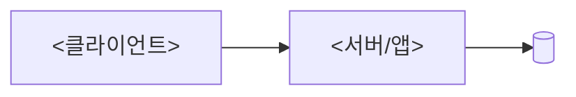

<!--
프로젝트 루트 README.md 골격. 양식 표준: team-harness docs/readme-standards.md
복사 후 <...> 자리를 채우고, 해당 없는 ○선택 섹션은 삭제한다.
-->

# {이모지} <프로젝트명> — <한 줄 요약>

[](https://github.com/<owner>/<repo>/actions)


[](LICENSE)

> **"<왜 이 프로젝트가 필요한가 — 가치 한 문장>"**

<스택·한두 문장 소개. 상세 기획은 `docs/` 또는 `PRD.md` 링크.>

---

<!-- ○ 섹션 5개+ 일 때만 목차 -->

## ✨ 주요 기능

| 기능 | 설명 |
|---|---|
| {이모지} <기능> | <설명> |

## 🧱 기술 스택

| 영역 | 스택 |
|---|---|
| **Backend** | <...> |
| **Frontend** | <...> |

## 🏗️ 아키텍처



- **<핵심 원칙 1>** — <설명>
- **<핵심 원칙 2>** — <설명>

## 🚀 시작하기

> **전제** — <Docker · 런타임 버전 등>

```bash
# 1) <인프라 기동>
# 2) <백엔드>
# 3) <프론트엔드>
```

**테스트 계정** — `<id>` / `<pw>` (`<접속 URL>`)

## 🧪 테스트

```bash
# <lint · test · build · e2e 명령>
```

## 📁 디렉토리

```
<주요 디렉토리 트리 + 한 줄 설명>
```

## 📚 참고 문서

- 작업 규약: [`AGENTS.md`](AGENTS.md) · 팀 표준: `github.com/grinvi04/team-harness/docs`

## 📄 라이선스

<License> © <소유자>
